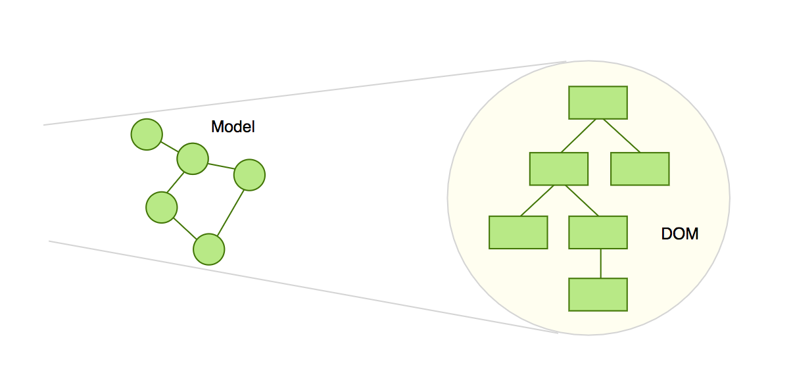
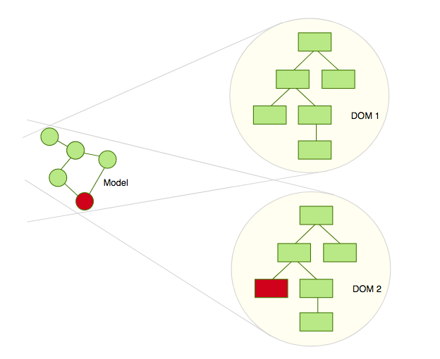
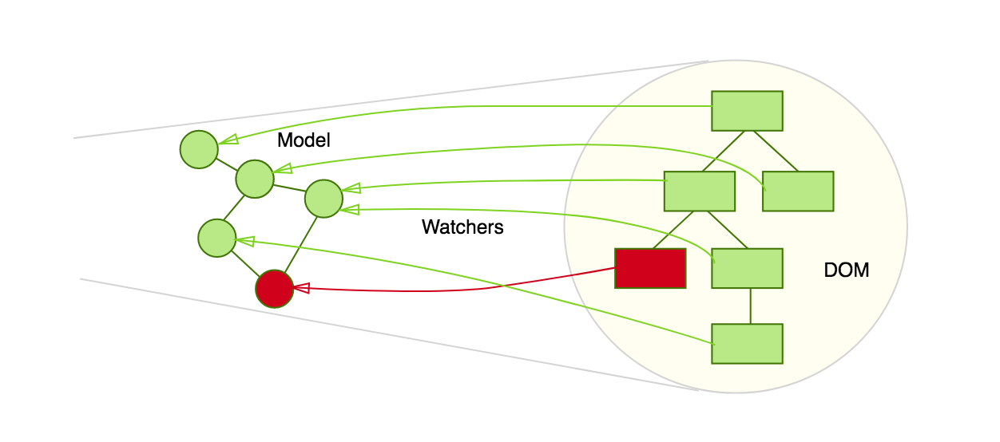
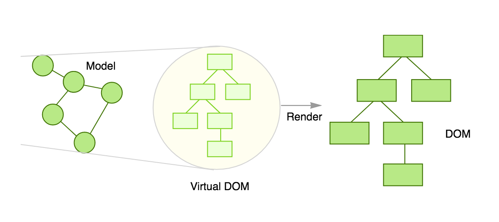
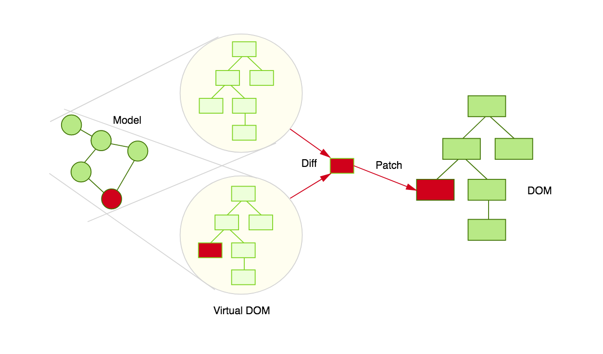
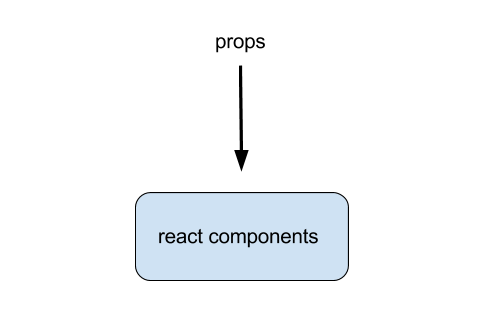
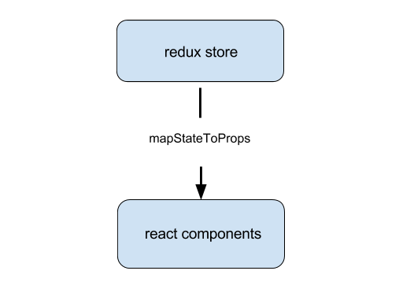
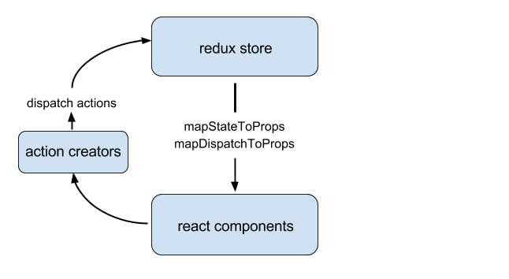
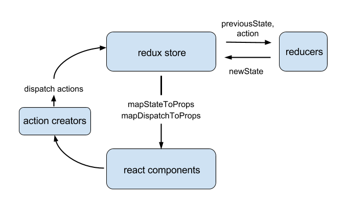

## React + Redux

---

### React
- a JavaScript lib for building presentational UI

<br>

### Redux
- a state container for managing state

---

### React

- Virtual DOM |
- One-way reactive data flow |

---

### Virtual DOM

- Update of sub-tree only
- No need to re-render the whole DOM on every change

---

### DOM



<span style="font-size:0.5em"><a href="http://teropa.info/blog/2015/03/02/change-and-its-detection-in-javascript-frameworks.html" target="_blank">image: h/t teropa</a></span>

+++

### Re-Render: Reload




<span style="font-size:0.5em"><a href="http://teropa.info/blog/2015/03/02/change-and-its-detection-in-javascript-frameworks.html" target="_blank">image: h/t teropa</a></span>

+++

### Re-Render: Watcher



<span style="font-size:0.5em"><a href="http://teropa.info/blog/2015/03/02/change-and-its-detection-in-javascript-frameworks.html" target="_blank">image: h/t teropa</a></span>

+++

### React Virtual DOM



<span style="font-size:0.5em"><a href="http://teropa.info/blog/2015/03/02/change-and-its-detection-in-javascript-frameworks.html" target="_blank">image: h/t teropa</a></span>

+++

### Re-Render: Virtual DOM



<span style="font-size:0.5em"><a href="http://teropa.info/blog/2015/03/02/change-and-its-detection-in-javascript-frameworks.html" target="_blank">image: h/t teropa</a></span>


---

### Data

- Gets props from its parent: one-way data flow |
- Keeps a local, encapsulated state tree |
- Can pass local state as props to its children |

---

### An Example

```
const Welcome = ({name}) => {
  return (
    <h1>Hello {name}!</h1>
  );
}

ReactDOM.render(
  <Welcome name="Batman" />,
  document.getElementById('root')
);
```
@[1-5]
@[7-10]

<span style="font-size:0.75em"><a href="https://jsbin.com/lugokawori/edit?js,output" target="_blank">demo link</a></span>

---

### ES6 Syntax

Arrow functions

```
const sum = (a, b) => {
  return a + b;
}
```

```
function sum(a, b) {
  return a + b;
}
```

---

### ES6 Syntax

Destructuring

```
const someObject = {
  a: 10,
  b: 20,
  c: 30,
  d: 40,
};

const { a, b, ...rest } = someObject;

a; // 10
b; // 20
rest; // { c: 30, d: 40 }
```

```
function doThing(input) {
  process(input.a, input.b);
}

const doThing = ({a, b}) => {
  process(a, b);
}
```
<!-- .element: class="fragment" -->

---

### JSX Syntax

```
// JSX
return <Welcome name="Batman" />;

return React.createElement(Welcome, {name: 'Batman'}, null);
```

---

### Composing Components

```
const App = () => {
  return (
    <div>
      <Welcome name="Batman" />
      <Welcome name="Robin" />
    </div>
  );
}
```

---

### Rendering Logic

- Conditionals, if/else
- Arrays, loops

<span style="font-size:0.75em"><a href="https://jsbin.com/duxudapefu/edit?js,output" target="_blank">demo link</a></span>

---

### React Summary

- Performant re-rendering |
- Custom components |
- Composable |
- Logic-based rendering |

---

### Redux

- Manages state across components |
- Handles events |
- Single source of truth |

---

### React Props



---

### State To Props



---

### State Changes

- To change state, you dispatch an "action" |
- Reducers compute the new state |

---

#### previously...


---

### Map and Dispatch Actions

- <span style="font-size:0.6em">`mapDispatchToProps` provides callbacks that the react component would call</span>
- <span style="font-size:0.6em">Those callbacks would dispatch actions</span>
</span>



---

### Redux Flow

- <span style="font-size:0.6em">Given existing state and actions, reducers compute the new state</span>
- <span style="font-size:0.6em">React components re-render on state changes</span>



---

### Action Example

<span style="font-size:0.6em">
say we have a list with a `currentPageNumber` state
</span>

```
// an action creator
const changePage = (newPageNumber) => {
  return {
    type: actionTypes.CHANGE_PAGE,
    payload: { newPageNumber },
  };
}
```
@[3-6]
@[1-2]
@[1-7]

---

### Reducers

(previousState, action) => newState

- Are pure functions |
- Predictable, no side effects, easy to test |

```
const currentPageNumber = (state, action) => {
  if (action.type === actionTypes.CHANGE_PAGE) {
    return action.payload.newPageNumber;
  }
  return state;
}
```
<!-- .element: class="fragment" -->

---

### Combining Reducers

- Each reducer operates on a subtree of the state |
- Each is easy to test in isolation |
- Combine simple reducers to manage the single app state |

```
// example app state
{
  currentPageNumber: 2,
  filterBy: [ ... ],
  pages: {
    1: { ... }, // managed by pages and page reducers
    2: { ... },
    3: { ... },
  },
}
```
<!-- .element: class="fragment" -->

<span class="fragment" style="font-size:0.7em">
[link to reducers](https://gitlab.ims.io/monolith/trunk/blob/list-untwist/ui.scripts/src/webpack/components/list/reducers/dataTable.js#L140-148)
</span>

---

### DevTools

- Time travel demo
- Inspect actions and state

---

### Automated Tests

Each part can be tested in isolation

- Action creators

  <span class="fragment" style="font-size:0.7em">
  Verify expected actions are created, e.g. using mock api calls
  </span>

- Reducers

  <span class="fragment" style="font-size:0.7em">
  Verify (previousState, action) => newState
  </span>

- React components

  <span class="fragment" style="font-size:0.7em">
  Verify callbacks are called when expected
  </span>

  <span class="fragment" style="font-size:0.7em">
  Verify DOM diffs using snapshots
  </span>

---

### React + Redux Summary

- Stateless presentational components (React) |
- Single source of truth (Redux) |
- Composable |
- Easy to test |

---

### Resources

- Slack: [#react-js](https://ims-dev.slack.com/messages/react-js)

- Humans: Ryan, Andy, Nathan, Jonathan, Jenny

- Links: h/t Jonathan for a [great compilation here](https://ims-dev.slack.com/files/jonathan/F5P9PPHAA/React_Redux_Learning_Resources)
